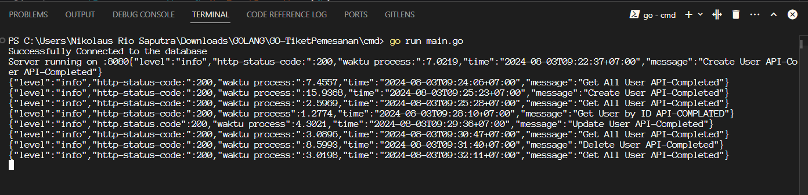
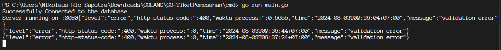

# Go-TiketPemesanan

Go-TiketPemesanan adalah aplikasi web berbasis API yang ditulis dalam Golang untuk mengelola pemesanan tiket secara online. Aplikasi ini menyediakan layanan CRUD (Create, Read, Update, Delete) untuk entitas seperti pengguna, event, dan pesanan tiket. Dengan menggunakan framework Gin dan PostgreSQL sebagai database, aplikasi ini berjalan di port 8080 dan menawarkan berbagai endpoint untuk memudahkan manajemen data dan transaksi tiket secara efisien.

## 1. Folder event
Folder event berisi file yang mengelola operasi terkait event atau acara.

### create event

### get all event

### find by Id event

### Log Event

### Folder Validation: Mengandung validasi data untuk memastikan input pengguna sesuai dengan aturan sebelum diproses.

## 2. Folder user
### Folder user berisi file yang mengelola operasi terkait pengguna.

### create user

### find by id user

### get all user

### update user

### setelah update

### delete user

### setelah Delete

### Log User

### File user_validation.go: Mengandung validasi data pengguna untuk memastikan input sesuai dengan aturan sebelum diproses.

## 3. Folder orders
### Folder orders berisi file yang mengelola operasi terkait pesanan atau transaksi.

### create order

### get all orders

### setelah order balance berkuang 

### setelah order stock berkurang 

### Log orders

### File order_validation.go: Mengandung validasi data pesanan untuk memastikan transaksi berjalan sesuai aturan.

